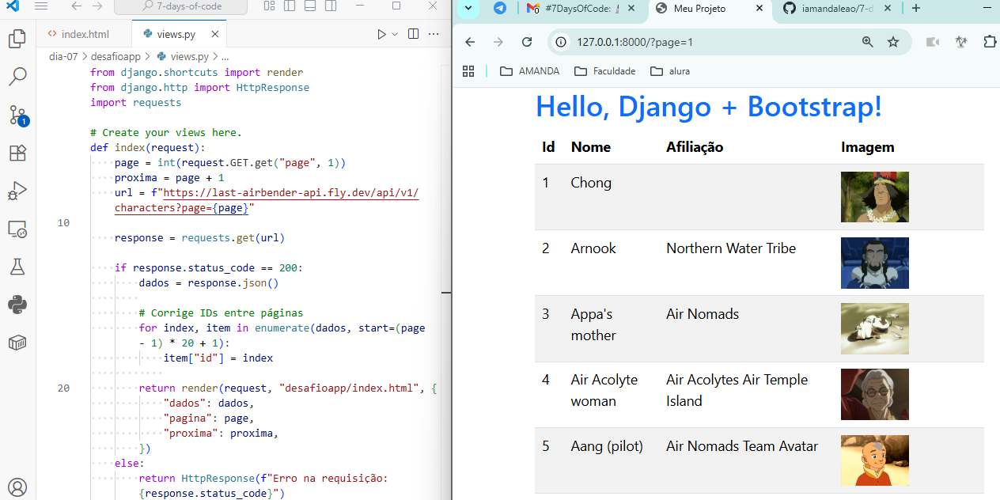

# 7 Days of Code: Django!

Projeto do [7 Days of Code com o Python para back-end](https://7daysofcode.io/matricula/python-web), na plataforma da **[Alura](https://www.alura.com.br/)**.

<div style="display: flex; justify-content: center;"></div>

## Sobre o projeto
Vamos consumir uma API de Avatar: A Lenda de Aang! Para isso, usaremos o Django como back-end e o Bootstrap para arrumar o front-end.

## Ao longo do projeto, as seguintes habilidades foram desenvolvidas:
- Python;
- Ambientes virtuais (venv);
- Framework **Django**;
- Consumo de APIs e uma requisição HTTP com o GET e o **módulo Requests**;
- Bootstrap;
- O uso da **biblioteca Googletrans**;
- Tags e filters do Django, em específico para criar IDs automáticos;
- Paginação.

## Tecnologias utilizadas neste projeto:
    

## Como reproduzir este repositório?
* Você pode fazer um `git clone` do repositório para a sua máquina, deste modo:

```
git clone https://github.com/iamandaleao/7-days-of-code.git
```
* Para instalar as bibliotecas:

```
pip install -r requirements.txt
```

* E, para rodar o projeto:

```
python manage.py runserver
```

## Status


